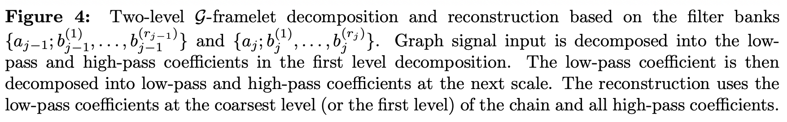
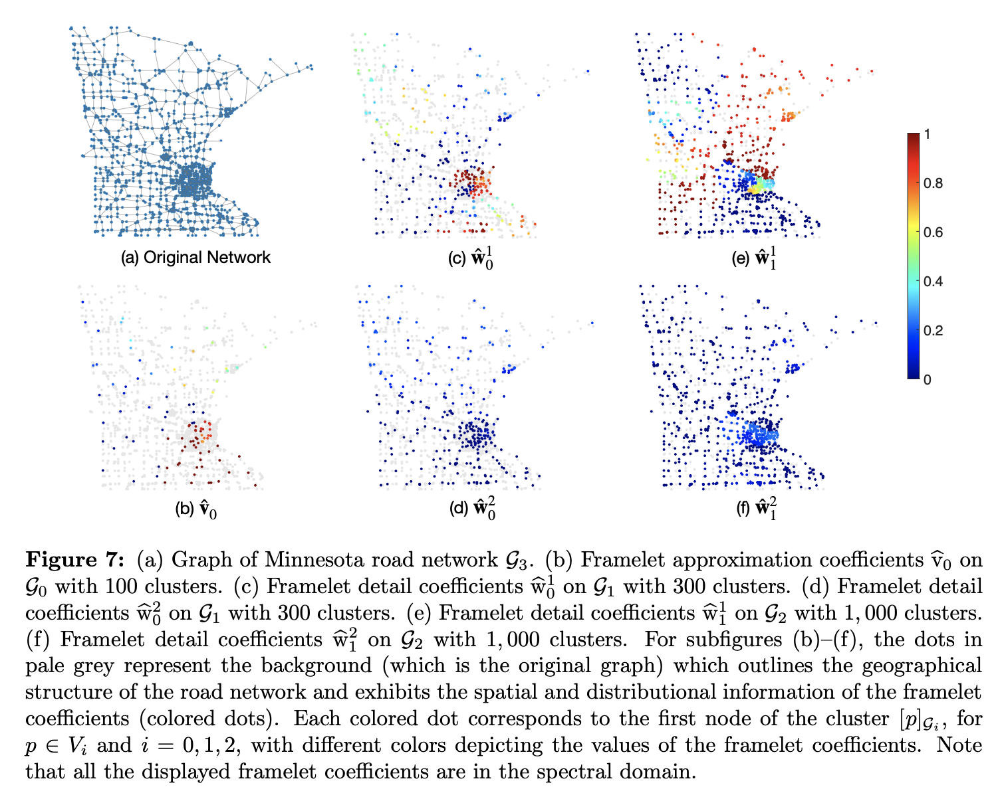

# Decimated Framelet System on Graphs and Fast G-Framelet Transforms

This repository is the official implementation of [Decimated Framelet System on Graphs and Fast G-Framelet Transforms](https://arxiv.org/abs/2012.06922). 




## Decimated Framelets on Road Network

The following figure shows the original graph of [Minnesota road network](http://networkrepository.com/road-minnesota.php) and the plots of the decomposed approximation and detail framelet coefficients with a three-level F$\mathcal{G}$T. We set the number of nodes for the sub-graphs as [1000, 300, 100]. To obtain the plots below, you can use the MATLAB script (road_network/exp2.m).



### Requirements

The script (road_network/exp2.m) relies on the graph partitioning algorithm metismex.m for which you have to obtain the C programs from the [official website](http://glaros.dtc.umn.edu/gkhome/metis/metis/download) first and then follow the steps in [here](https://github.com/dgleich/metismex) to compile the C programs in order to call metismex.m directly from MATLAB.

## Graph Classification with F$\mathcal{G}$T-based Graph Convolution

We use F$\mathcal{G}$T to define a spectral graph convolution method, for which we name **FGConv**. We investigate the effectiveness of $\textsc{FGConv}$ on the graph classification tasks with the composed GNN model **FGConv-Sum** which has the following architecture: **FGConv - FGConv - SumPool - MLP**.

### Requirements

To install requirements:

```setup
pip install -r requirements.txt
```

### Training and Evaluation

To train and test the model **FGConv-Sum** in the paper, run the following command. We provide the codes for **FGConv-Sum** on one of the benchmarks (D&D) from Table 6. The dataset will be downloaded and preprocessed before training. All the experiments were performed using [PyTorch Geometric](https://github.com/rusty1s/pytorch_geometric) and run on the NVIDIA Tesla V100 GPU with 5,120 CUDA cores and 16GB HBM2 mounted on a high performance computing cluster.

To re-produce the result of **FGConv-Sum** on graph classification benchmark D&D, we can run:
```
python fgconv_dd.py
```
You can change other hyperparameters from the script: batch_size, learning_rate, weight_decay, nhid, epochs, num_high_pass, but we suggest to use the default values for these hyperparameters.

###  Results

The composed model **FGConv-Sum** achieves the following performance on graph classification benchmark datasets MUTAG, PROTEINS and D&D. The table below shows the mean test accuracy with SD for 10 repetitions. Compared to existing methods such as **GIN**, **PatchySan**, **GDCNN** and **DIffPool**, the **FGConv-Sum** achieves top test accuracy on two of these datasets. The result on D&D can be obtained using the above .py programs. The test results on other benchmarks and comparison with the results of other methods can be seen in the paper.


## Citation 
If you want to cite our paper, please use the citation below:

```
@article{zheng2020fast,
  title={Decimated Framelet System on Graphs and Fast $\gph$-Framelet Transforms},
  author={Zheng, Xuebin and Zhou, Bingxin and Wang, Yu Guang and Zhuang, Xiaosheng},
  booktitle={arXiv preprint arXiv:2012.06922},
  year={2020}
}
```

## Contributing
Copyright (c) <2020> <NeurIPS>

Permission is hereby granted, free of charge, to any person obtaining a copy
of this software and associated documentation files (the "Software"), to deal
in the Software without restriction, including without limitation the rights
to use, copy, modify, merge, publish, distribute, sublicense, and/or sell
copies of the Software, and to permit persons to whom the Software is
furnished to do so, subject to the following conditions:

The above copyright notice and this permission notice shall be included in all
copies or substantial portions of the Software.

THE SOFTWARE IS PROVIDED "AS IS", WITHOUT WARRANTY OF ANY KIND, EXPRESS OR
IMPLIED, INCLUDING BUT NOT LIMITED TO THE WARRANTIES OF MERCHANTABILITY,
FITNESS FOR A PARTICULAR PURPOSE AND NONINFRINGEMENT. IN NO EVENT SHALL THE
AUTHORS OR COPYRIGHT HOLDERS BE LIABLE FOR ANY CLAIM, DAMAGES OR OTHER
LIABILITY, WHETHER IN AN ACTION OF CONTRACT, TORT OR OTHERWISE, ARISING FROM,
OUT OF OR IN CONNECTION WITH THE SOFTWARE OR THE USE OR OTHER DEALINGS IN THE
SOFTWARE.
